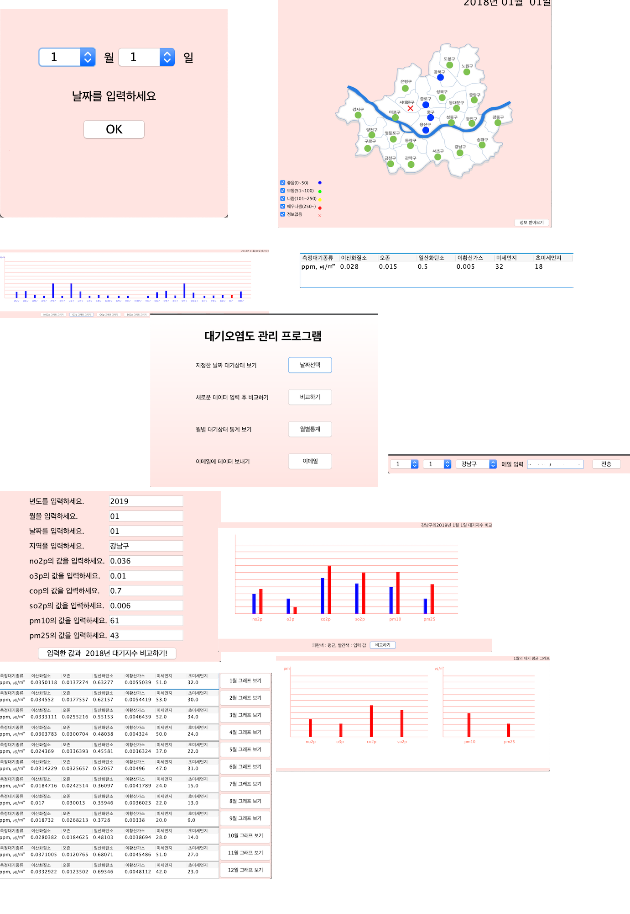

# Advanced Objective Programming

2019 fall semester Advanced Objective Programming term project

## User Stories

- [x] Connection DB by JDBC
- [x] Read CSV File and input at DB
- [x] Calculate AirData to CAI
- [x] Send select by ymDate of DB data
- [x] When you have no data, you can retrieve it from website.(http://cleanair.seoul.go.kr/air_pollution.htm?method=period)

### Notice
- First time you should install MYSQL.
- You must include the external API in the resource directory of your JAVA Build path
- DB does't have a sever.
- I make this program assuming the DB server is open. So I recommend opening the server. And link with server.

## API Lists
- mysql-connector-java-8.0.18.jar
- mail-1.4.7.jar

### air

- Filed		| Type 		| Null | Key | Default | Extra
- ymDate	varchar(8)	   No	PRI		NULL
- loc_name	varchar(20)	   No   PRI		NULL
- no2p		decimal(4,3)   YES	   		NULL
- o3p		decimal(4,3)   YES	   		NULL
- cop		decimal(2,1)   YES	   		NULL
- so2p		decimal(4,3)   YES	   		NULL
- pm10		decimal(4)	   YES	   		NULL
- pm25		decimal(4)	   YES	   		NULL

### Current State

